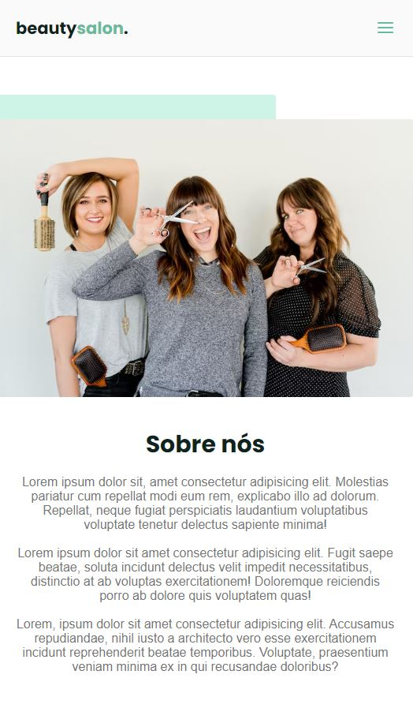
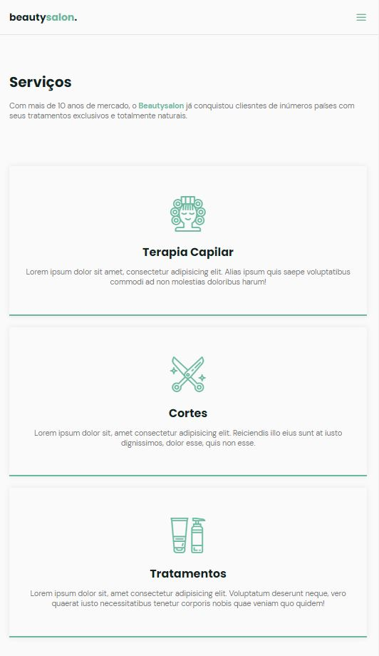
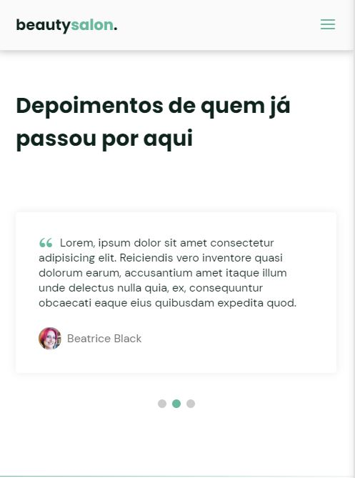

<h1 align="center"> Beauty Salon </h1>

Projeto acadêmico 

  <a href="#tecnologias">Tecnologias</a>&nbsp;&nbsp;&nbsp;|&nbsp;&nbsp;&nbsp;
  <a href="#projeto">Projeto</a>&nbsp;&nbsp;&nbsp;|&nbsp;&nbsp;&nbsp;
  <a href="#layout">Layout</a>&nbsp;&nbsp;&nbsp;|&nbsp;&nbsp;&nbsp;
  <a href="#link">Link</a>

 

## Tecnologias

Esse projeto foi desenvolvido com as seguintes tecnologias:

- HTML e CSS
- JavaScript
- Git e Github
- Figma

## Projeto

O Beauty Salon é um site de beleza.

## Layout

  

  

  

  

  

## Link

https://jorge-saraiva.github.io/beatysalon/